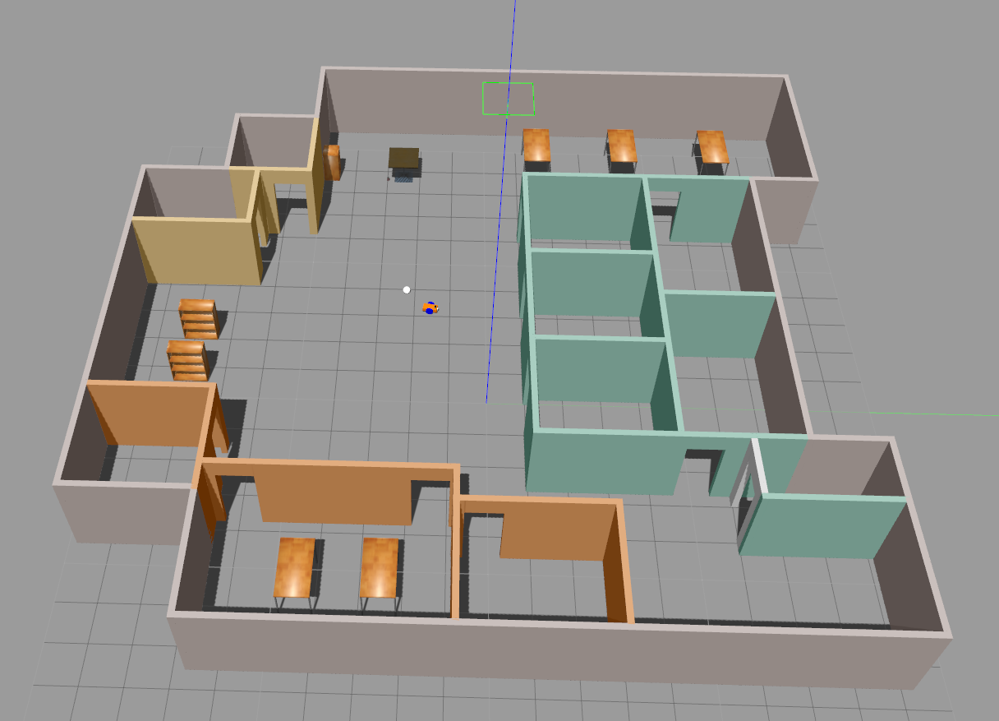
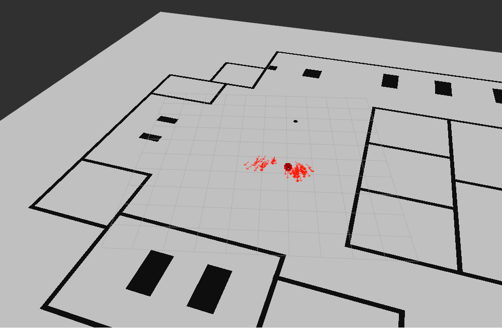
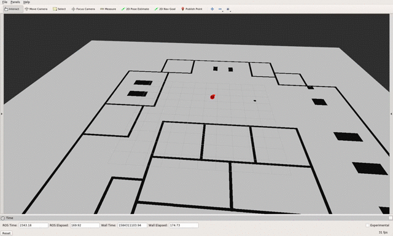

# WhereAmI
This is the code for my Udacity Robotics Software Engineer Nanodegree  - Where Am I. It creates a simulation world with Gazebo and uses AMCL package to localize the robot.

### Directory Structure
```
    udacity_bot                        # main folder, which contains world files, launch files and relevant resources
    ├── images                         # Gazebo world with plugin output image
    │   ├── whereami_amcl.png          # Example rviz screen with 2D map loaded
    │   ├── gazebo.png                 # Example gazebo world
    │   ├── whereami.gif              # localization with AMCL
    ├── launch
    │   ├── robot_description.launch
    │   ├── world.launch               # The entry point launch file for myworld
    │   ├── amcl.launch                # The entry point launch file for AMCL localization, which includes Map Server, AMCL node, and Move Base Node
    ├── meshes                         # Gazebo provided meshes
    │   ├── hokuyo.dae                 # hokuyo lidar mesh file
    ├── urdf                           # robot description files
    │   ├── my_robot.gazebo            # plugin definitions
    │   ├── my_robot.xacro             # main URDF file
    ├── world                          # Gazebo main World containing models
    │   ├── myworld.world              # The main world file
    ├── CMakeLists.txt
    ├── package.xml                    # the ROS package file created by catkin_create_pkg
    ├── udacity_bot.rviz               # the rviz configuration file
    └── README.md
```

### Steps to launch the simulation

#### Clone the project folder in /home/workspace/
```sh
$ cd ${your_catkin_ws}/src
$ git clone git@github.com:glc12125/udacity_bot.git
```

#### Compile the code
```sh
$ cd ${your_catkin_ws}
$ catkin_make
$ source devel setup.bash
```

#### Launch Gazebo world and services  
```sh
$ cd ${your_catkin_ws}
$ roslaunch udacity_bot world.launch
```

In another commandline window

```sh
$ cd ${your_catkin_ws}
$ roslaunch udacity_bot amcl.launch
```

### Output
You should expect two new windows: the gazebo world and rviz window. For the udacity_bot launch, the RobotModel, Map, and PoseArray should have been added by default in rviz for visualization. You should see something similar to the following:

Gazebo world:


Rviz


For the amcl launch, you should be able to test the localization via "2D Nav Goal" button from RViz or the teleop Node in another terminal. You should expect something like the following demo:

