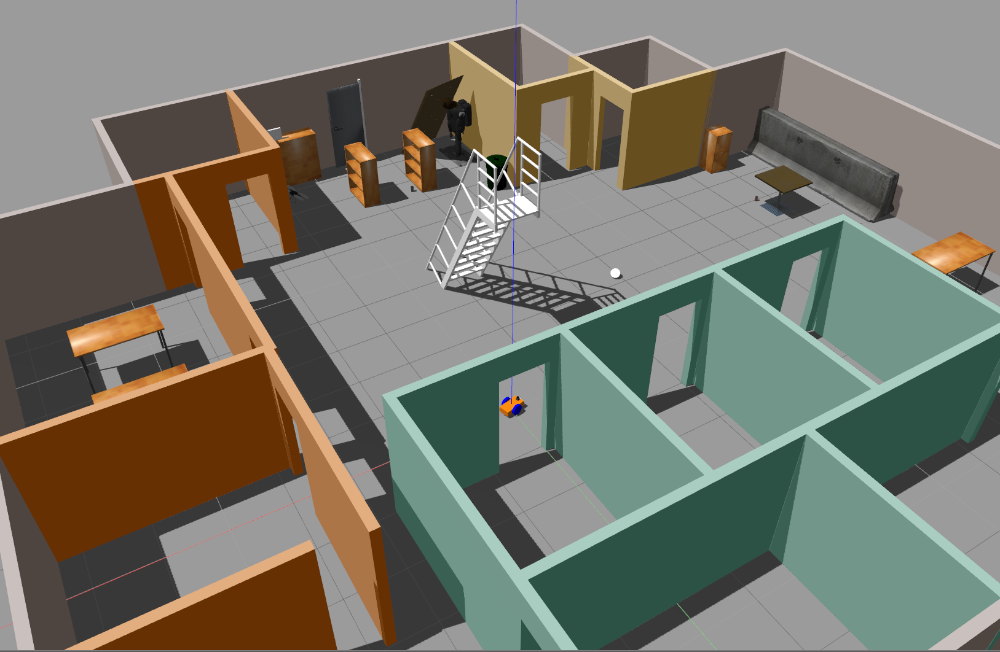

# BuildMyWorld
This is the code for my Udacity Robotics Software Engineer Nanodegree  - Build My World. It creates a simulation world with Gazebo and uses RTAB Mapping(GraphSLAM) to localize the robot in the map.

### Directory Structure
```
    map_my_world                       # main folder, which contains world files, launch files and relevant resources
    ├── images                         # Gazebo world with plugin output image
    │   ├── rviz_map.png               # Example rviz screen with 2D mapping loaded
    │   ├── gazebo.png                 # Example gazebo world
    │   ├── loop_closure_detection.png # Example run with more than 3 global loop closures detected
    │   ├── rtab-mapping.gif           # Map created in rtabmapviz
    ├── launch
    │   ├── robot_description.launch
    │   ├── world.launch               # The entry point launch file for myworld
    │   ├── mapping.launch             # The entry point launch file for rtab and rtabviz
    │   ├── localization.launch        # The entry point launch file for rtab and rtabviz in localization mode
    │   ├── teleop.launch              # The entry point launch file for teleop keyboard control
    ├── meshes                         # Gazebo provided meshes
    │   ├── hokuyo.dae                 # hokuyo lidar mesh file
    ├── urdf                           # robot description files
    │   ├── my_robot.gazebo            # plugin definitions
    │   ├── my_robot.xacro             # main URDF file
    ├── world                          # Gazebo main World containing models
    │   ├── myworld_new.world          # The main world file
    ├── map_my_world.rviz              # the rviz configuration file
    └── README.md
```

### Steps to launch the simulation

#### Clone the project folder in /home/workspace/
```sh
$ cd /home/workspace/
$ git clone https://github.com/glc12125/map_my_world.git
```

#### Compile the code
```sh
create a package in your catkin workspace to host map_my_world with the same name 
$ cd ${your_catkin_ws}/src
$ catkin_create_pkg map_my_world
$ cp -r /home/workspace/map_my_world/* ${your_catkin_ws}/src/map_my_world/
$ cd ${your_catkin_ws}
$ catkin_make
$ source devel/setup.bash
```

#### Launch Gazebo world and services  
```sh
$ cd ${your_catkin_ws}
$ roslaunch map_my_world world.launch
```

In another commandline window, enable keyboard control

```sh
$ cd ${your_catkin_ws}
$ roslaunch map_my_world teleop.launch
```

In another commandline window, enable rtab mapping

```sh
$ cd ${your_catkin_ws}
$ roslaunch map_my_world mapping.launch
```

(Localization mode) Close mapping window and in another commandline window, enable ratab localization

```sh
$ cd ${your_catkin_ws}
$ roslaunch map_my_world localization.launch
```


### Output
You should expect two new windows: the gazebo world and rviz window. For the world launch, the RobotModel, Map should have been added by default in rviz for visualization. You should see something similar to the following:

Gazebo world:


After controlling the robot via teleop node, you should expect the Rviz window to look like following:

Rviz


If the rtabviz is turned on(by default), you should be able to visualize the map created by rtab package in realtime. You should expect something like the following demo:


### Loop closure detection

After driving the robot via teleop for a while, you should have visited the same place for multiple times. And this is how I test loop closure detection. By default, the rtabmap.db will be created under ${your_catkin_ws}/src/map_my_world/rtabmap.db. To replay and evaluate the map, use the following command:

```sh
$ cd ${your_catkin_ws}
$ rtabmap-databaseViewer ${your_catkin_ws}/src/map_my_world/rtabmap.db
```

And you should expect something like the following:


, where 30 global loopclosures were detected.